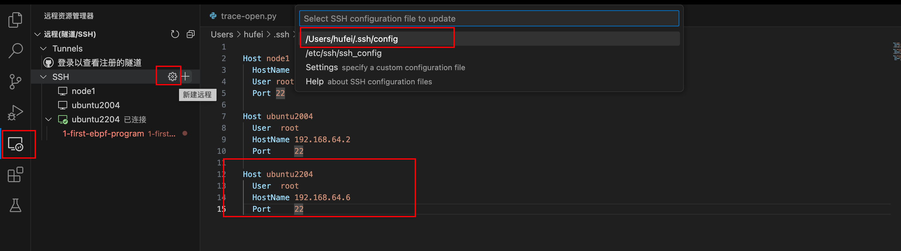
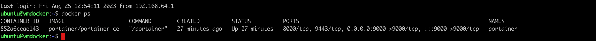

### 一: 使用Multipass

背景: Mac m1平时测试验证会有linux 虚拟机下操作的需求，但是virtualbox vmware 对m1的支持有限。

multipass 是ubuntu 开源的工具可以在macm1 下快速启动虚拟机。然后我们可以基于虚拟机做各种各样的测试


---

### 二: 如何安装Multipass

有多种安装方式，由于本人是mac os，所以只针对macos的进行说明。（windows/linux 均支持）

1. 直接使用macos的包管理工具brew 进行安装

   `brew install --cask multipass` 即可

   如果需要卸载的话 可以使用: `brew uninstall multipass`

   

   

2. 或者可以安装包进行安装

   安装包地址参考github官网: https://github.com/canonical/multipass/releases/

   然后一路点击continue 即可安装。

   如需卸载: `sudo sh "/Library/Application Support/com.canonical.multipass/uninstall.sh" `


3. multipass常用命令

   `multipass list` 查看当前有多少个虚拟机

   

   `multipass info ubuntu2204` 查看指定虚拟机的信息

   

   `multipass find` 查找可用的OS镜像

   

   `multipass launch --name vm5 22.04` 创建虚拟机

   

   `multipass shell vm5` 登录虚拟机

   

---


### 三: 创建虚拟机报错

1. `launch failed: Downloaded image hash does not match `

   

2. 查看multipass日志

   `sudo cat /Library/Logs/Multipass/multipassd.log`

   

   看起来是网络超时？无法下载ubuntu镜像

    

3. 于是按照网上说的方法，下载镜像到本地

   

4. 启动虚拟机的时候指定image

   

   发现还是失败

    

5. multipass 不支持除linux以外的平台使用 http/file

   https://github.com/canonical/multipass/issues/1029

   


---

### 四: 走代理创建虚拟机

实在没招，通过代理的方式进行ubuntu的方式进行安装


---

### 五: 创建好的虚拟机设置ssh登录

如果需要登录虚拟机，提供两种登录方式

1. 直接在终端执行命令: `multipass shell vm1`

   


2. 如果本地ide需要接入直连，则需要设置ssh

   先通过`mutilpass shell vm1` 直接登录进去，切换root用户，设置密码

   

   然后安装ssh 服务, `apt install openssh-server`

   安装完成后，修改ssh配置 `vim /etc/ssh/sshd_config`:

   ```shell
   PermitRootLogin prohibtxxx ==> PermitRootLogin yes
   PasswordAuthentication no ==> PasswordAuthentication yes
   ```

   修改完成后: `service ssh restart `

   然后本地ssh 测试:

   


---

### 六: 如何对接vscode

Vscode 通过remote-ssh 插件参与远程项目的调试，非常方便


1. 打开vscode，搜索remote-ssh，安装即可

   

2. 配置登录文件

   按照图中框出来的配置，点击填写即可

   

   该方式要求每次重新连接的时候都需要手动键入密码，有点麻烦。可以通过密钥的方式进行登录

    

   3. 配置密钥免登录

      首先服务器需要开启密钥认证。 `vim /etc/ssh/sshd_config` 修改

      

      

      将本地mac中id_rsa.pub传送到 对应虚拟机

      `multipass transfer id_rsa.pub ubuntu2204:/home/ubuntu/.ssh`

      然后将其中的内容，复制到该目录的 authorized_keys这个文件中(root 用户下 vim  ～/.ssh/authorized_keys)

      

      
      
      然后修改vscode中的ssh config文件:
      
      其中IdentityFile填入刚才设置的私钥，即id_rsa文件的路径
      
      
      
      
      
      免密登录成功:s
      
       
      
      


---

### 七: 使用multipass安装docker虚拟机

1. 安装命令 

   `multipass launch -c 2 -m 4G -d 40G -n vmdocker docker`

   ```bash
   image » multipass launch -c 2 -m 4G -d 40G -n vmdocker docker                                                                                                                  
   You'll need to add this to your shell configuration (.bashrc, .zshrc or so) for
   aliases to work without prefixing with `multipass`:
   
   PATH="$PATH:/Users/hufei/Library/Application Support/multipass/bin"
   Mounted '/Users/hufei/multipass/vmdocker' into 'vmdocker:vmdocker'
   ```

   

   安装成功，此时该虚拟机vmdokcer，带有docker客户端和portainer

   

   

2. 使用alias创建别名

   ```bash
   alias multipass docker:docker
   PATH="$PATH:/Users/hufei/Library/Application Support/multipass/bin"
   ```


3. 直接主机上使用docker命令

   因为创建了alias，所以可以在主机上直接使用docker命令

   

   

4. 访问portainer UI

   默认安装了portainer(没怎么用过),端口是9000。浏览器访问主机IP:9090

   

   类似于一个docker的 管理界面 
